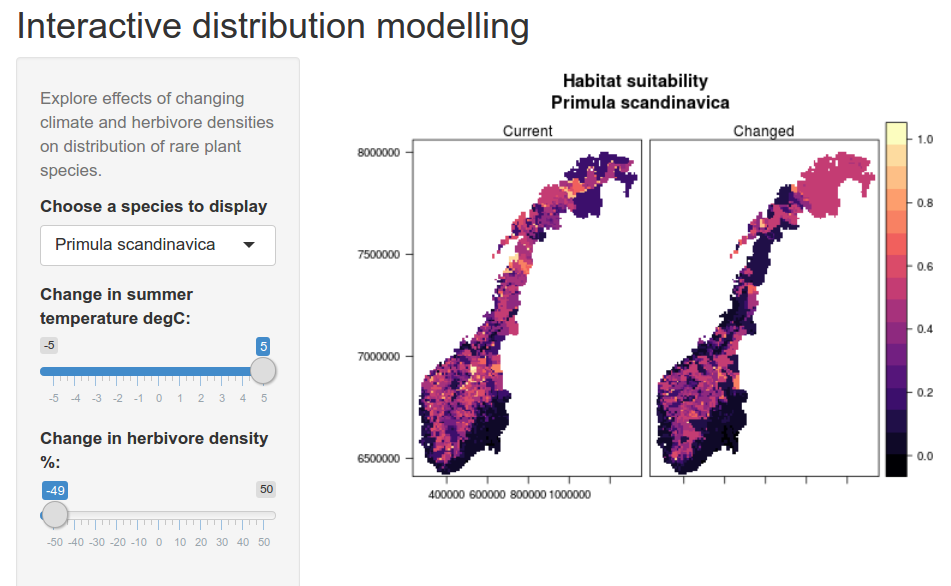

<!-- README.md is generated from README.Rmd. Please edit that file -->
sdmShiny
========

<!-- badges: start -->
<!-- badges: end -->
This project is for disseminating the species distribution modeling work done in James Speed's group at the NTNU University Museum. We will use web-based Shiny apps to present distribution maps of several species and allow these to change with the predictions of the SDM as the user tweaks the parameters for climate and herbivory. 

Installation
------------

Developers should clone the repo and work from there.One can also install the development version from [GitHub](https://github.com/) with:

``` r
install.packages("devtools")
devtools::install_github("anders-kolstad/sdmShiny")
```

Example application
-------------------

Follow this link <https://anderskolstad.shinyapps.io/demoSDM/>

Documentation
=============

This section explains the workflow that ended up the the shiny app. The r project is arranged as an r package. All r code such as functions are in the 'data' folder.

1) Get species list
-------------------

This is the first function. It produces a list of species that we will later use to harvest occurence data from gbif. ...

``` r
source("./R/spList.R")
mySpecies <- sl()
head(mySpecies)

# alternatively
# mySpecies(df = TRUE)
```

Get environmental data (explanatory/independent variables)
==========================================================

From the alpine red listed species paper, I got this sent over from James:

``` r
IV <- raster::stack("data/large/selectvars.grd")
names(IV)
#> [1] "TundraHerbivores"  "MeanTempWarmQuart"
raster::plot(IV[[1]])
```

 The first layer is the combined metabolic biomas of reindeer (wild and semi-domesticated) and sheep from the year 1999. I will use this later, but not the worldclim variable (see below).

``` r
# reindeerSheep <- IV[[1]]
# writeRaster(reindeerSheep, 'data/reindeerSheep')
reindeerSheep <- raster::stack('data/reindeerSheep.grd')
#plot(reindeerSheep)
```

``` r
reindeerSheep
#> class      : RasterStack 
#> dimensions : 165, 112, 18480, 1  (nrow, ncol, ncell, nlayers)
#> resolution : 10000, 10000  (x, y)
#> extent     : 234554.5, 1354554, 6410509, 8060509  (xmin, xmax, ymin, ymax)
#> crs        : +proj=utm +zone=32 +datum=WGS84 +units=m +no_defs +ellps=WGS84 +towgs84=0,0,0 
#> names      : TundraHerbivores 
#> min values :                0 
#> max values :           969.93
```
